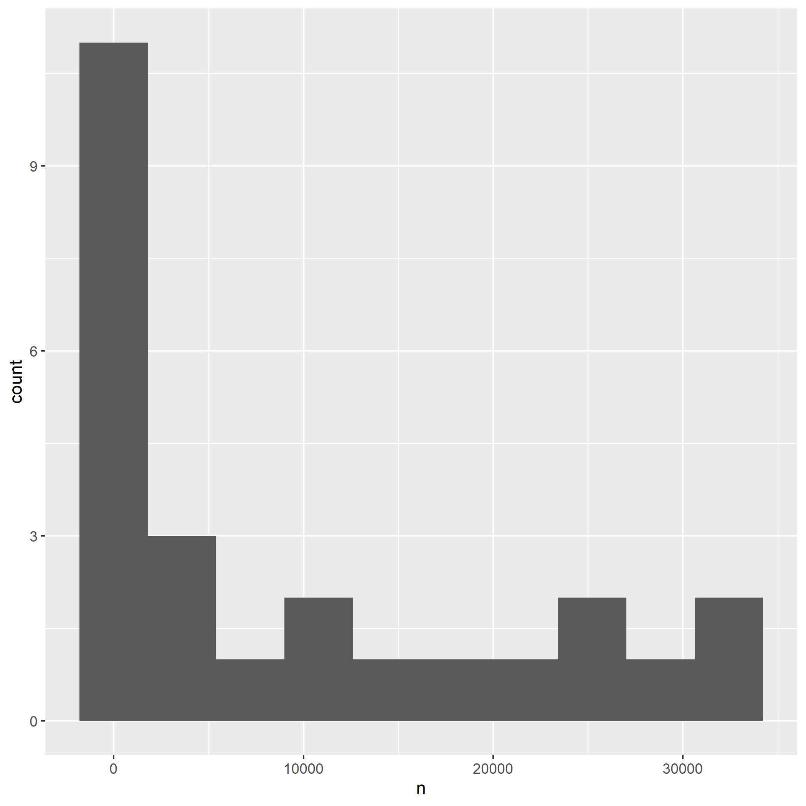

On most *nix systems, the file `data/` contains a bunch of words. On my machine, it contains 2.3597\times 10^{5} words.
I computed the length of each word, i.e. the number of characters, and tabulated how many words consist of 1 character, 2 characters, etc.
The most frequent word length is 9.
Here is a histogram of word lengths.

