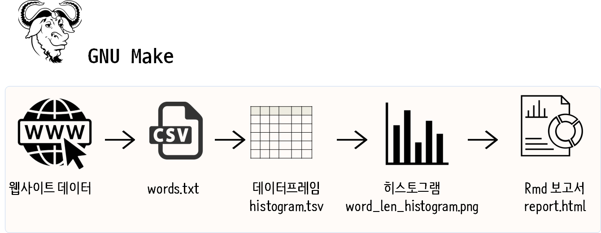

```{r setup, include=FALSE}
knitr::opts_chunk$set(echo = TRUE, message=FALSE, warning=FALSE,
                      comment="", digits = 3, tidy = FALSE, prompt = FALSE, fig.align = 'center')

```

# WSL 2 {#windows-wsl2}

윈도우 10 WSL2를 사용해서 `make` 프로그램을 돌린다. 이를 위해서 `wsl` 우분투에 R 최신버전을 설치하고 `tidyverse`등 연관 팩키지를 설치한다.

1. 최신 R 설치 [^install-latest-R] 
1. `install.packages("tidyverse")`를 설치하기 위한 사전 설치 팩키지
    - `sudo apt-get install -y libxml2-dev libcurl4-openssl-dev libssl-dev`
1. R 팩키지 설치
    - `install.packages(c("tidyverse", "DT", "here", "stopwords", "tidytext"), dependencies=TRUE)`

[^install-latest-R]: [Lisa Tagliaferri (July 5, 2018), "How To Install R on Ubuntu 18.04"](https://www.digitalocean.com/community/tutorials/how-to-install-r-on-ubuntu-18-04)

# 한국어 `make` 동영상 {#korean-make}

아래 유튜브 동영상이 보이지 않는 경우, 즉 **{}** 메시지만 보이고 아무것도 보이지 않는 경우, `blogdown::install_hugo('0.54.0', force = TRUE)` 명령어로 다시 `blogdown` 휴고를 설치한다. [^blogdown-hugo]

[^blogdown-hugo]: [stackoverflow, "Cannot use Markdown shortcodes in Blogdown's Rmd files"](https://stackoverflow.com/questions/55856904/cannot-use-markdown-shortcodes-in-blogdowns-rmd-files)

```{r korean-make, eval =FALSE}
blogdown::shortcode("youtube", "jnJL6ppn26Q")
```

- 바로가기: **[시골사는개발자, "Makefile 시작하기"](https://www.youtube.com/watch?v=jnJL6ppn26Q)**

# 윈도우 `make` [^windows-make] {#makefile-windows}

[^windows-make]: [stat545, "Chapter 34 make: special considerations for Windows"](https://stat545.com/make-windows.html)

윈도우 환경에서 `make`를 설치할 수 있는 방법이 있지만, stat545에서 추천하는 방식은 [`Make for Windows`](http://gnuwin32.sourceforge.net/packages/make.htm) 프로그램이다.

1. [`Make for Windows`](http://gnuwin32.sourceforge.net/packages/make.htm) 웹사이트를 방문해서 `setup` 프로그램을 다운로드 받는다.
1. `make-3.81.exe` 파일을 더블클릭하여 설치한다.
    - `C:\Program Files (x86)\GnuWin32\` 디렉토리에 설치된다.
1. 제어판으로 가서 환경변수에 `make.exe` 파일을 등록시킨다.
    - `C:\Program Files (x86)\GnuWin32\bin`
    
# `make` 헬로월드 {#make-helloworld}

먼저 `make`를 실행하기 위해서 헬로월드를 찍어보자.
이를 위해서 `Makefile`을 만든다.
`all:`, `clean:`은 대표적인 `make` 명령어를 실행할 때 하나의 관습처럼된 명령어다.
주의할 점은 `@echo ...` 시작부의 화이트스페이스가 공백이 아니라 탭이라는 점이다.

```{r Makefile, eval=FALSE}
# Makefile
all:
	@echo start build task !!!

clean:
	@echo clean all !!!
```

`make all` 명령어를 실행하여 헬로월드를 찍어보자.

```{bash make-all}
make all
```

다음과 같이 `clean` 작업 후에 `all` 빌드작업을 수행한다.

- Build All - `make all` 실행
- Clean All - `make clean` 청소작업 수행
- Clean and Rebuild - `make clean all` 청소작업 후 빌드작업 재수행


# 예제 {#makefile-step-by-step}

{#id .class width="100%"}

## 파일 다운로드 {#step01-download}

작업을 모듈화하기 위해서 먼저 `R/` 디렉토리 아래 모든 R 스크립트를 모아둔다.
가장 먼저 데이터를 얻는 작업은 `download_words.R` 파일에 기록한다.
즉, 웹사이트에서 `https://svnweb.freebsd.org/base/head/share/dict/web2?view=co` 텍스트 파일을 다운로드 받아 `data/` 디렉토리 `data/words.txt` 파일로 저장시킨다.

```{r downloadfile, eval=FALSE}
## R/download_words.R
## Download words.txt file
download.file("https://svnweb.freebsd.org/base/head/share/dict/web2?view=co", destfile = "data/words.txt", quiet = TRUE)
```

`Makefile`은 다음과 같이 구성한다. 즉, `make all` 명령어로 빌드를 하는데 `data/words.txt` 파일이 없으니 이를 얻기 위해서 `R/download_words.R` 스크립트를 실행시키게 된다.

```{r Makefile-start, eval=FALSE}
# Makefile
all: data/words.txt

data/words.txt:
	Rscript R/download_words.R
```

## 데이터 정제 파일 {#step02-dataframe}

원본 데이터를 가지게 되면 다음 단계로 데이터 정제작업을 수행해야 한다. 
이를 위한 데이터 정제 작업 및 시각화 모형개발용 데이터프레임 제작작업을 수행한다.
`tidyverse`를 불러와서 `processed` 디렉토리를 생성한 앞서 다운로드 받은 `words.txt` 파일을 데이터프레임으로 전처리 작업을 수행한다.
전처리 작업결과를 `processed/histogram.tsv` 파일로 저장시킨다.

```{r make-dataframe, eval=FALSE}
## R/make_dataframe.R
library(tidyverse)

dir.create("processed")

words_df <- read_csv("data/words.txt", col_names=FALSE)

words_df %>% 
  set_names("word") %>% 
  mutate(word_len = str_length(word)) %>% 
  count(word_len) %>% 
  write_delim("processed/histogram.tsv", delim="\t")
```

이번에 `make all` 작업을 수행하게 되면 파일을 다운로드 받고 이를 처리하는 작업을 수행한다. 한가지 `make`를 사용하면 좋은 점은 앞선 작업은 이미 처리되었기 때문에 다시 재작업을 수행시키지 않는다는 점이다.

```{r Makefile-dataframe, eval=FALSE}
all: data/words.txt processed/histogram.tsv

data/words.txt:
	Rscript R/download_words.R

processed/histogram.tsv:
	Rscript R/make_dataframe.R
```

## 그래프 파일생성 {#step03-graph}

다음 단계로 그래프 파일을 생성하는 단계가 남아있다. 
앞서 원데이터에서 데이터프레임으로 변형시켜 `.tsv` 파일로 저장시켜 둔 것처럼 단어 길이에 대한 분포를 파악하고자 히스토그램을 시각화한 `.png` 파일을 만드는 작업을 수행한다.
이를 위해서 앞서와 마찬가지로 `make_histogram.R` 스크립트 파일을 생성하여 작업한다.

```{r make-histogram, eval=FALSE}
## R/make_histogram.R
library(tidyverse)

word_length_df <- read_delim("processed/histogram.tsv", delim="\t")

word_len_histogram <- word_length_df %>% 
  ggplot(aes(x=n)) +
    geom_histogram(bins = 10)

ggsave("processed/word_len_histogram.png")
```

이번에도 `processed/word_len_histogram.png` 파일을 만들기 위해서 `Rscript R/make_histogram.R` 명령어를 실행시킨다.

```{r Makefile-histogram, eval=FALSE}
all: data/words.txt processed/histogram.tsv processed/word_len_histogram.png

data/words.txt:
	Rscript R/download_words.R

processed/histogram.tsv:
	Rscript R/make_dataframe.R

processed/word_len_histogram.png:
	Rscript R/make_histogram.R
```

## 보고서 생성 {#step04-report}

이제 보고서를 생성하는 단계로 `make_report.R` 파일에 `rmarkdown::render()` 함수를 사용해서 HTML 보고서를 자동생성시켜보자.

```{r make-report, eval=FALSE}
## R/make_report.R
library(tidyverse)

rmarkdown::render("analysis/report.Rmd", 
                  output_format="html_document",
                  output_file = "report.html",
                  encoding = 'UTF-8', 
                  output_dir = "analysis")
```

`Makefile`을 다음과 같이 작성하여 전체 자동화를 위한 얼개를 만들어낸다.

```{r Makefile-report, eval=FALSE}
all: analysis/report.html data/words.txt processed/histogram.tsv processed/word_len_histogram.png

data/words.txt:
	Rscript R/download_words.R

processed/histogram.tsv:
	Rscript R/make_dataframe.R

processed/word_len_histogram.png:
	Rscript R/make_histogram.R
	
analysis/report.html:
	Rscript R/make_report.R
```

## `Makefile` 정리 {#step05-makefile}

`Makefile`이 다소 지저분하여 이를 깔끔하게 만들어보자.
`make clean`도 도입하고 몇가지 외계기호를 넣어 `make` 파일로 만들어본다.

`make` 변수를 도입하여 코드를 단순화하고 의존성도 함께 정리하여 코드를 단순화 시킨다.

```{r decorate-Makefile, eval=FALSE}
DATA_DIR = data
REPORT_DIR = analysis
TEMP_DIR = processed

all: $(REPORT_DIR)/report.html 

$(REPORT_DIR)/report.html: R/make_report.R $(TEMP_DIR)/word_len_histogram.png
	Rscript $<

$(TEMP_DIR)/word_len_histogram.png: R/make_histogram.R $(TEMP_DIR)/histogram.tsv
	Rscript $<

$(TEMP_DIR)/histogram.tsv: R/make_dataframe.R $(DATA_DIR)/words.txt
	Rscript $<

$(DATA_DIR)/words.txt: R/download_words.R
	Rscript $<

clean:
	rm -f analysis/*.html analysis/*.md $(TEMP_DIR)/*

.PHONY: clean	
```


